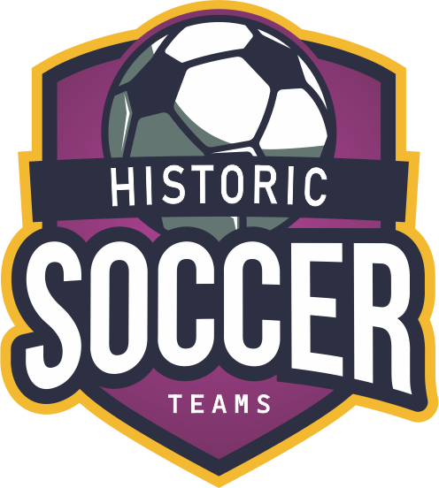
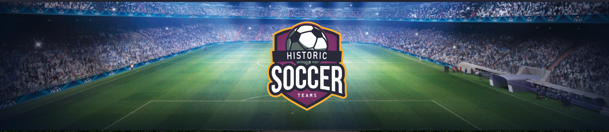
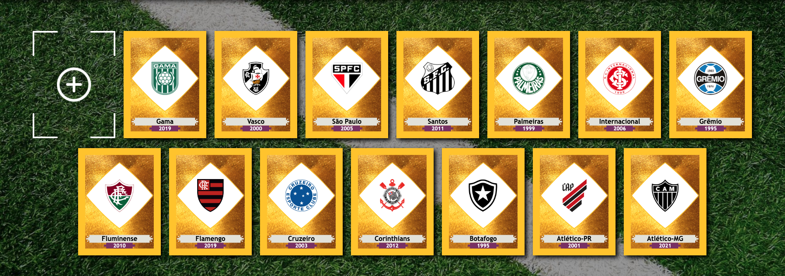
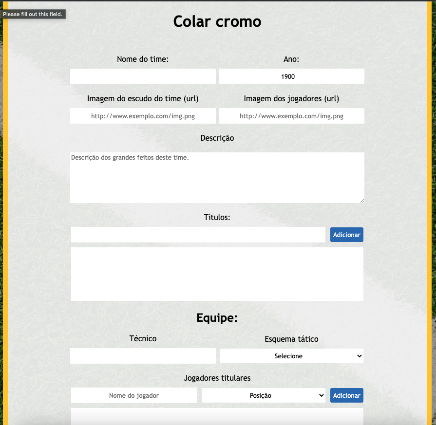

# BEST SOCCER TEAMS

Projeto realizando durante o bootcamp de Web Development da Ironhack.
Utilizamos conhecimentos obtidos nas 5 primeiras semanas do bootcamp.
Fizemos o uso de bibliotecas como React.js e React Hot Toast com base em Javascript, HTML e CSS.
O objetivo do projeto é criar um banco dados que pode ser atualizado e editado por usuários.
Esse banco de dados armazena informações sobre os maiores times do futebol brasileiro.
Se não encontrou o seu esquadrão favorito, sinta-se à vontade para adicioná-lo.

Para visitar o site: [Clique aqui](https://bestsoccerteams.netlify.app/home)
para saber mais, [veja essa apresentação](www.google.com)

## Criadores

### Igor Lopes

[Github](https://github.com/IgorALopes)
[Linkedin](https://www.linkedin.com/in/igor-lopes-83232ba9/)

### Maxwell Paulo

[Github](https://github.com/maxwell-paulo)
[Linkedin](https://www.linkedin.com/in/-maxpaulo/)

